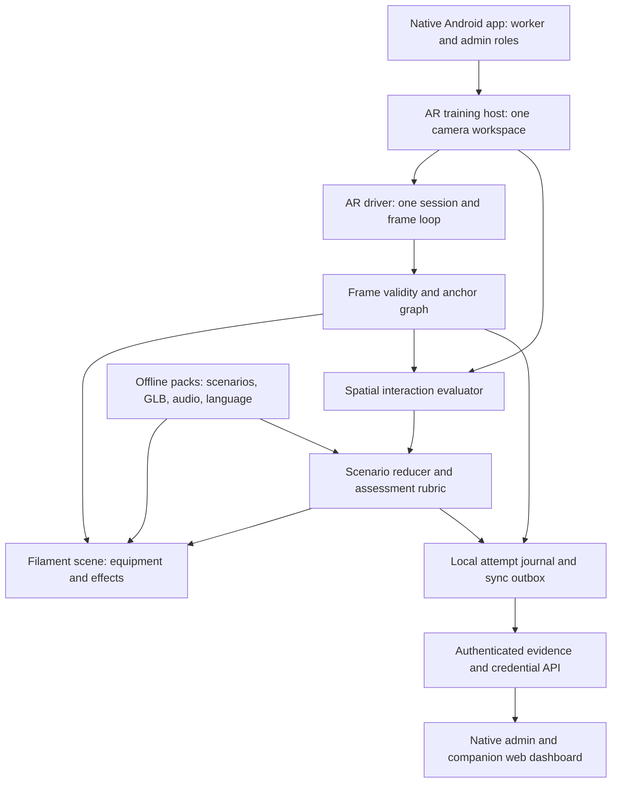
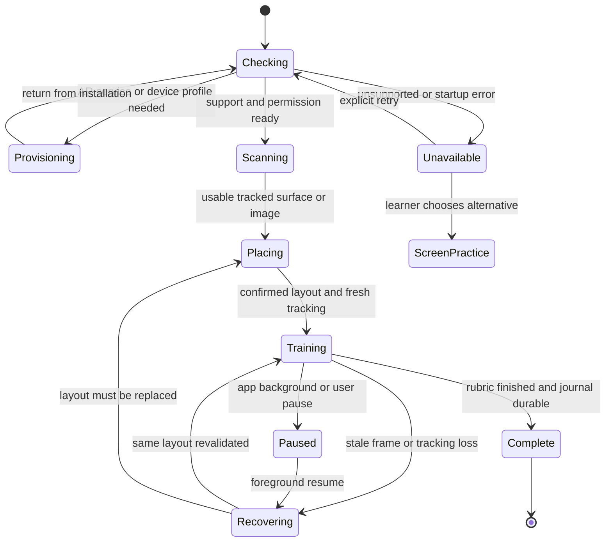

# AR runtime architecture for Suraksha Saathi

Design date: 16 September 2026. Baseline: `bd4ddfc`, Android pilot 0.7.0. Status: **architecture roadmap with a partially implemented native runtime; the full target below is not complete**.

Implementation progress: all four camera paths now use `NativeArDriver` for
session/frame ownership, camera leasing and freshness guards. Physical testing
identified a sensor-rate permission problem; the permission restored 200 Hz
motion sampling on the Samsung. A separate placement fix allows mapped anchor
patches while retaining an amber warning for an incompletely mapped full model.
The user confirmed three-anchor stability, and camera fire-evacuation and
outside-only gas practice completed. The fixed-screen candidate additionally
placed two stations and rejected overlapping footprints, with automatic Hindi
speech confirmed by the user. See the [current learning/release evidence](learning-update-2026-09-16.md)
and [sensor investigation](ar-sensor-rate-investigation.md). Filament, authored
GLB equipment, printed-image placement and independent spatial certification
remain future stages; this release does not claim those integrations.

The objective is two complete, usable camera AR training modules on supported mid-range Android phones: stable equipment placement, meaningful equipment interaction, branching safety procedures, and trustworthy descriptions of what was assessed. Android 10+ remains the application minimum. A compatible ARCore device is additionally required for camera AR.

## 1. Decision and current evidence

Keep the native Android application and adopt **one shared AR runtime, ARCore tracking, Filament rendering, and a versioned action-based scenario engine**. Preserve the existing accounts, local records, assessment logic and admin backend. Richer rendering must pass the same tracking and evidence contracts as the basic scene.

The renderer integration candidate is the maintained SceneView library's `ARScene`, isolated behind an app-owned adapter. Its ARCore/Filament integration avoids building a second camera compositor from scratch. This is a candidate for a device-tested, pinned dependency, not permission to track its moving main branch. The repository's existing `SceneView.kt` is an unrelated local drawing class. Filament supplies physically based rendering and a glTF loader; realistic equipment still requires authored assets. [Filament project](https://github.com/google/filament), [SceneView AR implementation](https://github.com/sceneview/sceneview/blob/main/arsceneview/src/main/java/io/github/sceneview/ar/ARSceneView.kt).

| Baseline observation before implementation | Architectural consequence |
| --- | --- |
| `ArActivity`, `RoomMissionView`, `ProcedureSceneView` and `ComponentCameraView` each construct an ARCore session and implement rendering/lifecycle behavior. They share `ArCameraSupport`, including a release barrier. | Consolidate ownership and recovery in one host. Four paths are a maintenance risk; this does **not** establish four simultaneous sessions or the cause of the phone failure. |
| `ArCameraSupport.configure` chooses a supported 30 fps configuration, horizontal planes, latest-image updates, fixed focus and ambient lighting. | Preserve a measured basic configuration first; test configuration changes independently. Do not assume an autofocus toggle or newer renderer fixes tracking. |
| `RoomMissionView` already checks frame freshness, anchor tracking, placement stability and current revisions. `RoomAnchorPose` composes current anchor transforms. | Extract and strengthen these invariants rather than discard the prior work. |
| `RoomMissionGeometry` builds procedural meshes and custom shaders. | Introduce an authored equipment asset pipeline with articulated controls and collision geometry. |
| `RoomMission` already includes fire exit/equipment/evacuation/assembly/reporting, an explosion-risk branch, and gas PPE/buddy/outside-role decisions. | Preserve these objectives; deepen spatial interaction and connect independent performance assessment. They are not all missing. |
| The 0.7 release report leaves physical tracking unvalidated. Earlier Samsung SM-S921B evidence records camera frames without usable placement. | First reproduce with Google's minimal sample and the current app on the same phone. The cause and a successful fix remain unconfirmed. |

Code evidence: [shared camera policy](../apps/android/app/src/main/java/com/narvyn/suraksha/ArCameraSupport.kt), [room renderer](../apps/android/app/src/main/java/com/narvyn/suraksha/RoomMissionView.kt), [mission logic](../apps/android/app/src/main/java/com/narvyn/suraksha/RoomMission.kt), [geometry](../apps/android/app/src/main/java/com/narvyn/suraksha/RoomMissionGeometry.kt), [release limitations](release-0.7.0.md), [physical-device record](ar-device-validation.md).

## 2. System boundary and data flow



The training loop has no server dependency after provisioning and pack installation. Authentication, organisation management, synchronization and issuer operations use the existing backend. The companion web dashboard remains available for the stated submission requirement; workers and administrators can perform their primary workflows in the Android app.

| Component | Owns | Must not do |
| --- | --- | --- |
| `ArTrainingHost` | One full-screen camera workspace, lifecycle intents, native HUD, language/audio, pause and exit | Construct its own second camera/session when a driver already owns one |
| `ArRuntimeCoordinator` | Capability checks, lifecycle generations, tracking state, driver commands and exclusive camera lease | Infer readiness from a visible camera image alone |
| `ArDriver` | Actual session, camera texture/compositor, render loop, per-frame callback, resource release | Run two update loops or publish old frame data as new |
| `AnchorGraph` | Station identities, current poses, local object transforms, placement/relocalization epochs | Restore old session world coordinates after process death |
| `EquipmentScene` | Authored models, materials, animation, lighting and optional occlusion | Decide whether an action passes an assessment |
| `InteractionEvaluator` | Ray/shape intersection, control constraints, hold/sweep measurements | Accept a screen hotspot unrelated to the visible object |
| `ScenarioReducer` | Reviewed transitions, role constraints, consequences, assistance and critical errors | Generate operating rules from an AI prompt at runtime |
| `AttemptRepository` | Durable events, checkpoints, idempotent outbox and migration | Turn guided completion into an independent-assessment pass |

These names describe new app-owned interfaces; they are not claimed library APIs. Start as packages in the existing app rather than creating many Gradle modules immediately.

## 3. Runtime ownership, frame integrity and recovery

With the SceneView adapter, **SceneView owns the ARCore session and `update` calls**. The coordinator sends lifecycle/configuration requests through that adapter and consumes its frame callback. Existing activities must not retain their own sessions. The integration gate must prove callback ordering, resource retirement and freshness handling; wrap or patch the driver if its defaults violate these contracts. If the gate fails, keep the basic native ARCore driver while resolving the adapter, rather than shipping two competing owners.

Use one serialized owner for frame-related mutations and scenario transitions. UI touches enter a bounded command queue. Background work handles pack I/O, database writes and synchronization; it never retains live `Frame`, `Image`, `Anchor` or renderer objects. An asynchronous database failure pauses completion instead of silently losing evidence.



Every active state also handles exit, camera errors and thermal suspension through the same serialized shutdown path. No indefinite automatic restart loop.

The app-owned frame snapshot contains session epoch, geometry epoch, frame timestamp, local monotonic receipt time, camera pose/projection, viewport revision, tracking/failure state, required anchor poses and optional depth/light metadata. Copy immutable values or use strictly owned buffers. Never compare ARCore timestamps to wall-clock time; track local age since receipt of each **distinct** frame.

An interaction is eligible only when the app is foreground, the latest camera frame is nonzero and fresh, camera and required anchors track, the layout is confirmed, and session/geometry/viewport revisions match the gesture. Consume render and hit-test transforms from the same snapshot. A callback repeating a frame may update presentation, but cannot add hold time or samples. Recheck eligibility at command consumption, not just touch-down.

On loss: cancel held tools, discard incomplete measurements, pause the active assessment clock, disable spatial actions and hide unreliable spatial guidance. Keep a native text/audio recovery prompt visible. A local watchdog also invalidates input if frame callbacks stop altogether. Recovery requires a new stable sequence and validated anchors, not a single successful callback. Retain completed logical checkpoints, but do not combine a gesture across interruptions or layouts. A mode switch ends the AR assessment attempt; screen practice uses a separately labelled attempt.

On exit or replacement: invalidate the generation and camera lease, stop frame production, wait for in-flight owner work, detach anchors, pause the session, retire resources, then admit a new owner only after release completes. Preserve the current asynchronous close barrier. Register valid camera textures for the active session/context and refresh them after context loss; never reuse destroyed GL resources. Runtime permission, AR service and device-profile checks precede session startup. [ARCore Android setup](https://developers.google.com/ar/develop/java/enable-arcore).

## 4. Reliable placement: a portable training bay

Provide two explicit setup modes, both using ARCore on supported devices:

1. **Printed training bay.** A low-cost, flat, feature-rich mat with a known printed width establishes a repeatable station. Distinct illustrated station cards identify exit A, exit B and assembly. A small QR can choose a pack, but is not the image used for tracking. Ship the image database with the pack, include a print-scale ruler, and reject incomplete image tracking during setup. The trainer confirms the clear practice area and card arrangement. Relocating a card invalidates its station and requires confirmation.
2. **Surface placement.** For sessions without printouts, scan a textured, well-lit surface; show a real-scale ghost and footprint; confirm equipment and station locations. Retain the existing stability, footprint, spacing and revision checks. Add a compact single-station mode when the room cannot accommodate a full layout; record its reduced spatial scope.

Google recommends feature-rich image targets and warns that QR/barcode-like line art tracks poorly. Known physical size improves setup; image tracking runs on-device. This makes the printed bay a useful proposal, not a guarantee in poor lighting or on unsupported phones. [Augmented Images guidance](https://developers.google.com/ar/develop/augmented-images).

Represent equipment geometry in metres with an explicitly validated export basis. Compose `T_world_object = T_world_anchor × T_anchor_station × T_station_object`. Renderers, colliders, boundary checks and event evidence all use that contract. Nearby equipment parts share one station anchor. Separate station anchors can shift relative to each other; recheck layout relationships and suspend spatial assessment if they become inconsistent. Reuse anchors and detach unused ones as Google recommends. [Anchor guidance](https://developers.google.com/ar/develop/anchors).

Persist station identities and local layout, not reusable raw world poses. On a fresh session, reacquire printed references or ask for placement again, increment the geometry epoch, and restore only valid logical progress. Instant placement may show an unscored preview; it cannot authorize a scored real-scale interaction before full placement validation.

These are simulated training stations. Plane detection does not identify a safe floor, certify a real exit, detect gas or inspect real machinery. The default is a cleared training room; no automatic routing through an operating workplace. Stationary selection is available, with walking-specific objectives recorded as unassessed.

## 5. Equipment that behaves like equipment

Create reviewed GLB assets for an extinguisher, gas detector, PPE kit, barrier, attendant/radio and an isolated machinery trainer. Model identity, scale and controls must match the chosen training equipment and reviewed procedure.

The asset contract includes source licence, physical dimensions, semantic node IDs, pivots, collision shapes, interaction constraints, animation clips, material maps and a content hash. For example, an extinguisher has separate pin, handle, hose/nozzle, gauge and cylinder nodes. Collision controls bind to semantic IDs; a mesh rename or missing control fails pack validation rather than silently disabling a step.

Use physically based metal/roughness/normal materials, legible equipment labels, contact shadows and restrained particles. Support levels of detail and compressed textures only where the pinned renderer actually supports them. Use a simple environment on the basic tier. Map valid Environmental HDR estimates into the PBR renderer on the enhanced tier, including a stable lighting fallback. Merely enabling an HDR flag is insufficient. [ARCore lighting integration](https://developers.google.com/ar/develop/java/lighting-estimation/developer-guide).

Interactions combine deliberate touch with geometry: select the visible handle, drag a pin along its permitted axis, hold the virtual lever, aim the nozzle ray at the virtual target and cover its base with a measured sweep. A camera-relative held-tool node is intentional and visually distinct from world-anchored equipment. Constraints and animation communicate why a control cannot move. Audio reinforces contact and state changes. Keep phone vibration disabled during camera tracking because it can disturb pose estimation; use optional haptics only in screen practice. Neither reproduces equipment weight, pressure or resistance. [ARCore runtime guidance](https://developers.google.com/ar/develop/runtime).

Depth occlusion is an optional enhancement after support checking. Validate availability/age and coordinate conversion; close acquired images promptly. Missing depth falls back to an unobstructed virtual render, and any objective requiring depth is unavailable or uses a separately reviewed variant. Critical recovery controls remain screen-visible. Depth estimates geometry, not hazard safety. [ARCore Depth integration](https://developers.google.com/ar/develop/java/depth/developer-guide).

## 6. Complete training modules and distinctive learning features

Each module uses one sequence: brief and role → setup → demonstration → coached attempt → independent variant → action replay → assigned refresher. The demonstration and independent attempt share objectives but differ in layout or announced conditions. Assistance is explicit. Critical errors cannot be averaged away by cosmetic points.

| Domain | Coherent AR exercise | Evidence and boundary |
| --- | --- | --- |
| Fire and explosion | Identify an announced simulated hazard, operate the virtual alarm, identify a usable exit, choose withdrawal or the reviewed authorised-role extinguisher branch, manipulate extinguisher controls, aim/sweep, follow the designated simulated route, select assembly and report a missing worker without re-entry. An announced explosion-risk variant requires the withdrawal branch. | Ordered actions; correct route/equipment decision; continuous valid aim/sweep samples; interruptions, assistance and critical choices. Withdrawal can be correct without forcing extinguisher use. Touching an assembly marker is not proof of physically reaching it. |
| Gas and confined space | Recognise the simulated restricted zone, inspect explicitly simulated detector information and work-permit conditions, select the role-specific PPE, position a barrier and outside attendant, establish buddy communication/acknowledgement, then refuse entry and escalate when prerequisites fail. | Boundary-relative choices; prerequisite checks; PPE rationale; communication sequence; refusal under changed conditions. Detector values are authored scenario data. No gas measurement, entry permission, respirator-fit or rescue-readiness claim. |
| Machinery, next complete module | Identify equipment controls and pinch points, choose the relevant reviewed isolation procedure, apply virtual lock/tag controls, verify the simulated energy state, check guards and follow controlled hand-back. | Ordered state transitions and scenario-specific critical stops. No instruction to operate live equipment. Final procedure requires site/equipment review; the supplied statement truncates the machinery requirements. |

Keep existing PPE/emergency content while confirming the full five-domain specification. Do not invent the omitted requirements or count a module title as a complete AR module.

Three distinctive features strengthen the architecture:

- **Portable training bay:** the same inexpensive printed references support setup, realistic scale and repeatable trainer-led sessions. Templates can be adapted to mining, steel and mica contexts after review.
- **Action replay with a counterfactual:** reconstruct the virtual scene from the event journal, pause at the first critical decision, and show the alternative in a clearly labelled teaching replay. It uses synthetic scene reconstruction rather than uploading a worker's camera video by default. Old world coordinates are not overlaid on a newly opened camera session.
- **Buddy challenge with cue fading:** rehearse outside/inside-role communication on one device with a trainer or partner; clearly label a solo simulated buddy. Reduce arrows and hints for an independent variant, then schedule targeted retrieval of missed decisions. Two-phone shared-world multiplayer is a later feature requiring its own spatial-alignment and connectivity design.

Hindi and Santali packs contain reviewed strings, fonts, captions and recorded narration. Bundle essential assets for both core modules. Respect preferred Santali script and obtain native-speaker safety review; critical instructions cannot silently substitute an unreviewed translation. Voice is playback-first, with touch alternatives. Speech recognition is optional and never the sole gate for a critical action. Evaluate delayed performance and trainer-observed transfer before claiming learning gains. [Existing learning evaluation plan](ar-learning-evidence.md).

## 7. Native camera workspace

Use a fixed, full-height camera viewport. A compact top strip shows stage and tracking status; one short instruction and replayable audio sit below it. Place the active tool control within comfortable thumb reach and keep Pause/Exit consistently accessible. Show equipment choices in an explicit full-screen picker when needed. There is no scrolling lesson page or swipe-up panel over the camera.

Use the light theme for setup, records and administration. In camera mode, use opaque or sufficiently contrasted controls against arbitrary backgrounds. Teal denotes primary actions, blue guidance, amber attention and red stop/critical states; pair every colour with text/iconography. Honour Android insets and at least 48 dp touch targets. At large text sizes, break instructions into explicit steps instead of clipping or shrinking text. Provide a seated/stationary variant without claiming equivalent movement evidence.

## 8. Offline content, assessment and credentials

Install packs atomically with manifest/hash verification, schema version, asset/control bindings, locale completeness and safety-review metadata. Include compatibility bounds for engine and rubric versions. Keep the active pack pinned for an attempt; activate an update between attempts and retain the old pack while needed for journal interpretation. No runtime content generation determines safety-critical rules.

Store an append-only attempt journal and periodic logical checkpoints in the existing local database. Add an outbox transactionally with each durable update. Synchronization uses unique attempt/event IDs, ordered sequence numbers and idempotent acknowledgements; retries after an acknowledgement loss cannot duplicate credit. Show conflicts and storage errors instead of discarding them. Add background sync separately with network constraints; current manual sync remains a valid first transport.

The proposed event envelope contains:

```text
attemptId, workerId, organisationId, sequence,
scenarioVersion, rubricVersion, assetPackHash, appBuild,
mode: guided_ar | independent_ar | screen_practice | observer_practical,
sessionEpoch, geometryEpoch, viewportRevision,
elapsedMs, frameTimestampNs, frameAgeMs, trackingState,
actionId, equipmentNodeId, outcome, reason,
measurementSummary, assistance, interruption
```

Store enough sampled/aggregated measurement evidence to recompute a rubric, with documented bounds and units. Validate event types, sequence, finite values, version compatibility, interruption boundaries and critical-stop rules on import. Server regrading establishes consistency of received evidence; a device log or hash chain is not hardware attestation and cannot prove the person performed the action.

Keep three separate outcomes: guided practice, independent virtual performance, and authorised observer practical assessment. Existing pilot knowledge credentials retain their original scope. A newly introduced AR performance credential must name its rubric, mode and limitations rather than retroactively upgrading old records.

Offline completion creates a local receipt and queued issuance request. Issuer-signed credentials use protected backend keys and authorised issuance; private issuer keys never ship in a worker APK. Cached public keys allow offline signature checking with an explicit last-known revocation state and clock limitation. Current validity requires an online check. Fully offline authorised issuance would need a separately designed trainer signing device and key-governance process; it is not assumed delivered here.

## 9. Capability and performance policy

| Tier | Experience | Evidence label |
| --- | --- | --- |
| Supported ARCore phone, basic profile | Anchors, interactive GLB equipment, basic lighting; no required depth | Camera AR, basic rendering |
| Supported phone with validated optional features | Same objectives plus measured HDR/depth enhancements | Camera AR, enhanced rendering |
| Unsupported phone or persistent tracking failure | Explicitly chosen on-screen rehearsal, lessons and records | Screen practice; does not satisfy AR-module acceptance |

AR Optional preserves app access on unsupported hardware. Initial AR service/device-profile provisioning can require a connection; prove offline operation after provisioning instead of promising a first-ever offline AR installation. [ARCore enablement requirements](https://developers.google.com/ar/develop/java/enable-arcore).

Start with a 30 fps camera profile and bounded per-frame work. Decode models/audio away from the frame owner, avoid per-frame database/network calls, pool hot-path buffers, load only current-scene assets, and limit transparent effects. Disable unneeded features. Under thermal pressure, reduce decorative effects and renderer workload first; suspend when tracking quality fails. Do not change scoring geometry silently to gain frame rate. Google documents competition for CPU resources, thermal monitoring and the `VIO frequency low` diagnostic; it does not establish that these caused this app's failure. [ARCore performance guidance](https://developers.google.com/ar/develop/performance).

Track camera-frame frequency separately from rendered-frame rate, frame-age distribution, update stalls, tracking-loss duration, memory trend and thermal state. A smooth UI animation cannot mask a stalled camera.

## 10. Implementation sequence and exit gates

| Stage | Deliverable | Exit gate |
| --- | --- | --- |
| 0. Diagnose | Run pinned Google Hello AR and current app on the previously failing phone; capture matched device/build/configuration logs and real-camera observations. | Establish whether minimal placement works under the same conditions. If both fail, investigate provisioning/device/environment; if only the app fails, isolate lifecycle/render/configuration differences. Neither outcome alone proves a particular cause. |
| 1. Unify runtime | Introduce `ar/runtime`, `ar/tracking`, one host and one driver; route the four camera paths through it while retaining existing geometry. | One session owner; complete recovery tests; physical placement and a minimal anchored interaction pass before adding graphical load. |
| 2. Prove renderer | Spike and pin SceneView/Filament; one authored extinguisher with working controls; adapt lifecycle and frame contracts. Record dependency versions/licences. | Correct camera/3D alignment, native input/insets, background/retry/context-loss handling and sustained mid-range performance. Reject adoption if these contracts cannot be met. |
| 3. Complete fire | Add printed/surface setup, reviewed equipment, route/assembly stations, withdrawal and extinguisher branches, independent rubric and replay. | Both branches complete on a physical phone; critical errors and tracking interruptions produce correct evidence. |
| 4. Complete gas | Add reviewed detector/PPE/barrier/attendant assets, prerequisite decisions and buddy/refusal branches. | Full outside-role mission and changed-condition failure branches pass physical tests. |
| 5. Integrate and release | Packs/locales, durable outbox, server replay, scoped credential issuance/verification, native admin and companion web views. | Cross-device records and QR checks, reviewed language packs, offline tests, signed release APK, matching source commit/checksum and actual-phone demo. |
| 6. Extend | Machinery mission, sector variants, optional depth and formative learning study. | Same runtime gates; additional safety/content approval and measured learning outcomes. |

The first deliverable is the diagnosis and minimal anchored interaction, not a more elaborate model viewer. Google's sample provides a useful baseline because it displays detected planes and supports placement. [Official Android quickstart](https://developers.google.com/ar/develop/java/quickstart).

Suggested code mapping:

```text
apps/android/app/src/main/java/com/narvyn/suraksha/ar/
  runtime/       ArTrainingHost, ArRuntimeCoordinator, ArDriver
  tracking/      FrameSnapshot, TrackingGate, AnchorGraph, PlacementController
  scene/         SceneViewDriverAdapter, EquipmentScene, LightingPolicy
  interaction/   RayPicker, ControlConstraint, AimSweepEvaluator
  scenario/      ScenarioReducer, ScenarioPack, IndependentRubric
  evidence/      AttemptEvent, AttemptRepository, DiagnosticSnapshot
content/ar/      Versioned scenario manifests, GLB assets, image databases, audio
```

Migrate `RoomMission` and existing pure geometry/freshness rules behind these contracts; keep saved v2 journals readable. Existing procedure/component screens become host modes. Keep legacy entry intents redirectable until migration is complete. Add capability/rubric fields through explicit backend and database migrations; do not reinterpret old practice records as AR passes.

## 11. What must pass before calling AR working

All thresholds below are **proposed engineering acceptance targets**, not observed results, ARCore guarantees or industrial operating distances. Fix the test scene, lighting, device state and measurement method before collecting results. Report failures and per-device distributions, not only an average.

| Test | Proposed acceptance and evidence |
| --- | --- |
| Device coverage | Previously failing Samsung plus at least two supported mid-range models, including depth/non-depth coverage where available and an Android 10+ lower-end target. Record exact OS, GPU, AR service and app versions. No physical matrix is marked passed by this document. |
| Startup and placement | At least 19 of 20 controlled cold starts reach a stable usable station within 30 seconds after permission/provisioning; test printed and surface placement separately. Record every timeout and correct recovery path. |
| Apparent alignment | In a controlled bay, compare virtual fiducials to a measured physical reference from fixed viewpoints before/after a two-minute walk-around. Target no more than 5 cm position and 5 degrees orientation discrepancy, with measurement uncertainty reported; this is visual registration testing, not a safety perimeter. |
| Sustained performance | Across a 20-minute representative mission, target p95 rendered-frame interval at most 50 ms and no unhandled camera stall. Report distinct-camera-frame gaps separately; every gap beyond the initial 150 ms freshness budget blocks scoring. Use a release build and record thermal conditions. |
| Tracking loss | Zero accepted spatial actions from stale, paused or wrong-epoch snapshots. Cancel incomplete holds immediately on observed invalidity and within the freshness timeout when callbacks stop. The recovery message target is within 250 ms. |
| Lifecycle | Permission denial/regrant, screen lock, background/foreground, camera contention, repeated retry, rotation/resize, GL context loss and process death produce no duplicate owner or false completion. Repeat 20 open/close cycles and inspect resource/memory trends. |
| Full scenarios | A reviewer observes uninterrupted real-camera fire and gas attempts, including safe alternative and unsafe-choice branches. Virtual controls remain aligned while the camera moves. Independent attempts cannot obtain hidden practice credit. |
| Offline/data integrity | After provisioning, airplane-mode cold start, both modules, checkpoint/restart and local receipt work. Reconnect/retry sync yields one record; full storage and malformed/duplicate events fail visibly. |
| Language/accessibility | All critical Hindi/Santali text/audio reviewed; full tasks work without speech recognition or network voices. Large text and seated paths expose all controls and report scope honestly. |
| Credential boundary | Practice cannot issue an independent credential; tampered/unknown/expired credentials reject correctly. Offline revocation uncertainty is visible; a separate practical review is required for practical status. |

Use pure reducer tests for ordering, interruptions and event replay; driver contract tests for lifecycle, callbacks and freshness; physical tests for actual camera geometry and sustained operation. ARCore recordings are useful regression inputs, but playback can produce different trackables/poses and cannot replace device testing. Capture camera datasets only with informed consent, local retention controls and an explicit deletion path. [ARCore recording and playback](https://developers.google.com/ar/develop/java/recording-and-playback/developer-guide).

The release proof should identify one commit, APK checksum and device matrix, then show placement, a walk-around, complete fire/gas actions, deliberate tracking loss/recovery, offline progress, trainer review and QR verification. Mark cuts and any screen-practice footage. A successful build or emulator run alone is insufficient.
