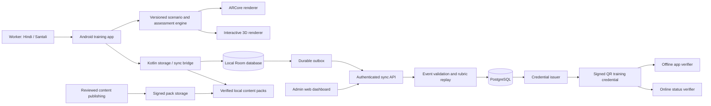

# Suraksha Saathi — engineering specification

Status: proposed architecture, not implemented. Version choices must be pinned after a real Android build and device smoke test.

## 1. Recommended stack

| Layer | Choice | Rationale |
| --- | --- | --- |
| Android training application | Unity supported LTS, C#, AR Foundation with matching ARCore provider | One interactive 3D runtime for AR and fallback scenes |
| Worker UI | Unity UI with tested Hindi/Ol Chiki font rendering | Avoid a second application shell for the initial APK |
| Native Android bridge | Small Kotlin plugin | Runtime checks, secure key storage, file import and background sync |
| Local persistence | Room database owned exclusively by the Kotlin plugin | Transactional attempts, content metadata and upload outbox |
| Sync scheduling | Android WorkManager through the plugin; explicit foreground sync | Durable retry without relying on the Unity scene remaining open |
| Admin web | React, TypeScript, Vite | Focused internal dashboard and public verification route |
| API | FastAPI, typed schemas, REST | Clear contracts, deterministic validation and simple deployment |
| Persistent server data | PostgreSQL | Tenant-scoped records, transactions, reporting and audit trails |
| Content / reports | S3-compatible object storage | Versioned immutable packs and generated reports |
| Signing | Standard asymmetric signature library; server-managed issuer keys | Independent verification with public keys |
| Packaging | Docker Compose for API, database and web; release APK | Reproducible judge setup and institutional deployment |

AR Foundation is an abstraction that requires a platform provider such as the ARCore XR Plug-in. Choose mutually supported package versions rather than installing unrelated latest versions. [Unity AR Foundation documentation](https://docs.unity3d.com/Packages/com.unity.xr.arfoundation@6.1/manual/index.html).

Use Unity as the main Android application initially. A Kotlin/Compose shell with Unity embedded can follow if native accessibility or organisation requirements justify its added lifecycle and build complexity. Do not build both shells in the MVP.

The Kotlin bridge owns local durable state and sync. C# calls narrow commands such as `beginAttempt`, `appendEvents`, `completeAttempt`, `listAssignments`, and `getSyncState`. It must never open the same Room database directly. Background jobs transport saved attempts; authoritative grading lives in the server and scenario specification.

## 2. Architecture



No internet call should be necessary to advance a prepared training scene. Android's offline architecture guidance supports local reads and queued writes; this design applies that model through a native data owner. [Android offline-first guidance](https://developer.android.com/topic/architecture/data-layer/offline-first).

## 3. Scenario and content contract

A scenario is a reviewed state machine, not an arbitrary script downloaded from a server. Use a bounded action vocabulary and a schema validator. Content packs contain assets and data, not executable code.

```json
{
  "schemaVersion": 1,
  "moduleId": "confined-space-awareness",
  "contentVersion": "1.0.0",
  "rubricVersion": "1.0.0",
  "sector": "steel",
  "competencies": ["recognise-space", "verify-prerequisites", "refuse-unsafe-entry"],
  "languages": ["hi-IN", "sat-Olck-IN"],
  "entryState": "inspect-boundary",
  "variants": ["missing-permit", "instrument-unverified", "attendant-absent"],
  "criticalGateIds": ["no-entry-without-clearance", "no-unplanned-rescue-entry"],
  "minimumAppVersion": "0.1.0",
  "reviewStatus": "draft"
}
```

This is illustrative metadata, not a reviewed training pack. Each state additionally defines prompt IDs, accessible descriptions, legal actions, transition predicates, applicable rubric items, critical failures, practice feedback, assessment behaviour, and restart rules.

Local language assets are keyed by ID. Keep recording text, audio, caption and approval status together. A pack cannot transition to `approved` if any required language, font, narration or critical feedback asset is missing. Certification assessments require approved content; drafts run only in development/trainer preview.

Pack manifest fields: ID, version, sector/site scope, rubric hash, file paths and hashes, total size, application compatibility, safety reviewer, language reviewers, review date, source mapping and signature. Validate paths and sizes during import to prevent path traversal or decompression abuse. Verify the signature and file hashes before atomic activation. Preserve the previous working version until activation succeeds.

A later withdrawal prevents new credential issuance from disallowed content according to the published withdrawal policy. Keep old versions available for historical evidence. Never silently rescore an old credential against a new rubric.

## 4. Attempt model

```json
{
  "attemptId": "random-uuid",
  "workerRef": "tenant-scoped-worker-ref",
  "deviceId": "enrolled-device-id",
  "assignmentId": "assignment-id",
  "moduleId": "fire-response",
  "contentVersion": "1.0.0",
  "rubricVersion": "1.0.0",
  "variantId": "primary-exit-blocked",
  "mode": "arcore",
  "locale": "hi-IN",
  "assessmentType": "uncoached",
  "events": [
    {
      "sequence": 1,
      "elapsedMs": 12500,
      "stateId": "raise-alarm",
      "actionId": "alarm-activated",
      "trackingState": "tracking",
      "hintUsed": false
    }
  ],
  "completionState": "in-progress"
}
```

Store versioned state snapshots, monotonic elapsed time, app version, capability mode, interrupted intervals and accommodation metadata. Avoid logging camera frames, continuous location, audio recordings, or unrelated personal information. If an evaluation study needs media, create a separate consented research workflow.

Server validation checks schema, identity/tenant scope, device enrollment, state-transition legality, event sequence, completeness, matching approved versions and duplicate IDs. It recomputes the score from the applicable rubric. Maintain shared golden test cases for C# and Python so grading cannot drift unnoticed.

Evidence replay must account for all causal scenario events, including the variant seed/parameters, injected hazards and input sequence. Log deterministic scenario transitions, not just final answers. Reject missing or inconsistent histories for credential issuance while retaining the record for review.

This detects inconsistent reports, not every fabricated client event. A compromised client can invent a plausible sequence. Device signatures, witnessed assessments and server checks improve assurance; describe that limit explicitly.

## 5. Offline and sync rules

1. Save an action batch and its upload job in one local database transaction. Save at state boundaries and before backgrounding.
2. Finalise attempts locally with a unique immutable attempt ID and pending validation status.
3. WorkManager uploads with exponential backoff and connectivity constraints. Provide a visible foreground “Sync now.” Background execution timing is OS-controlled.
4. The API uses attempt ID plus tenant as its idempotency boundary. An identical retry returns the original acknowledgement; changed content under the same ID is rejected.
5. Mark a job acknowledged only after a durable server response. Retries after a lost response cannot create a second credential.
6. Pull deltas by a server cursor: assignments, content manifests, trust keys and credential status. Retain the old cursor until local persistence commits.
7. Show separate counts for saved attempts, pending uploads and rejected records. Never delete pending work to free space silently.

### Conflict and failure behaviour

| Event | Required behaviour |
| --- | --- |
| Same worker trains on two phones | Keep both attempts; merge by attempt IDs, not last-write-wins |
| Worker profile is edited on two devices | Server-authoritative fields with explicit review for conflicting identity changes |
| App killed during training | Restore the last committed state; assessment restart policy depends on interruption scope |
| Device wall clock changed | Store an uncertainty flag; server issuance time is authoritative |
| Device reboots | Do not compare monotonic timestamps across boots; resume practice or restart the interrupted assessment |
| Device is offline after account removal | Prepared practice may remain available; server refuses unauthorised issuance on sync |
| Token expires offline | Allow local practice under the configured offline session policy; queue assessed results for identity revalidation |
| Content changes mid-attempt | Finish or restart using an explicit policy; never combine versions in one attempt |
| New enrolment without network | Create a provisional local identity; resolve it before named issuance |
| Local data lost before upload | Unrecoverable without an explicitly provisioned backup; do not claim guaranteed recovery |

First-release offline scope: prepared lessons, language assets, practice, assessment, progress, pending receipts, existing issued credentials, cached-key verification. Online work: initial enrollment/provisioning, new official issuance, current revocation status, cross-device reconciliation and dashboard updates.

## 6. Credential protocol

Use an established signing format and implementation, such as compact JWS with ES256. Fix the accepted algorithm and verify `kid` against an issuer trust store. Do not accept arbitrary algorithms or trust a public key supplied by an untrusted QR. Keep credential signing private keys in server secret/KMS storage, never in the APK.

Proposed QR form: `https://<verification-host>/v#<compact-signed-token>`. A generic scanner opens the verification page; the Android verifier recognises the URI and validates the token locally. The page verifies the token and then queries the server by credential ID for current status. Redact tokens from analytics and logs; do not attach third-party analytics to the verification page.

Signed claims include schema version, issuer, credential ID, pseudonymous subject reference, module/rubric versions, competencies or compact scope reference, simulation/practical status, issue time and configured expiry. Keep the payload compact and measure actual QR density on printed badges. Proposed target: encoded content below 900 bytes; validate the complete URI, not just JSON length.

Online verification returns: authentic/invalid signature, recognised/unrecognised issuer, active/revoked/expired/superseded/not-found status, and scope. Offline verification returns authenticity and cached status freshness separately. If trusted time or recent revocation data is unavailable, display that uncertainty and require online confirmation for workflows that need current validity.

Device keys used to attest uploads are distinct from issuer keys. Use Android Keystore with hardware backing when available; do not assume every supported phone provides the same protection. A device key cannot authorise certificate issuance. [Android Keystore documentation](https://developer.android.com/privacy-and-security/keystore).

Revocation is an appended action with reason, actor and timestamp. Do not edit a signed credential. Reissue or supersede it. Retain key history for old credentials and distribute signed trust updates using a previously trusted root, with an explicit compromised-key policy.

## 7. Core server entities and API surface

Entities: Tenant, Site, Worker, EmploymentAssignment, Device, Trainer, Module, ContentVersion, RubricVersion, LanguageAsset, TrainingAssignment, Attempt, AttemptEvent, CompetencyResult, PracticalObservation, Credential, CredentialStatusEvent, SyncReceipt and AuditEvent.

Every business row carries tenant scope, with database constraints and server checks preventing cross-tenant access. Public verification uses a deliberately restricted projection.

| API | Purpose |
| --- | --- |
| `POST /v1/devices/enrol` | Register an authorised device and public key |
| `GET /v1/sync?cursor=...` | Pull scoped changes with pagination |
| `POST /v1/attempts:batch` | Idempotent attempt upload and per-item acknowledgement |
| `GET /v1/content/manifests` | Discover compatible approved packs |
| `POST /v1/practical-observations` | Authorised assessor records a versioned checklist |
| `POST /v1/credentials` | Issue only after server-side requirements are satisfied |
| `GET /v1/verify/{credentialId}` | Minimal live verification projection with rate limits |
| `POST /v1/credentials/{id}/revoke` | Privileged, audited revocation with reason |
| `GET /v1/reports/training-status` | Site/role requirement status and data freshness |
| `GET /v1/trust-bundle` | Signed public-key and revocation metadata update |

Admin authentication is separate from worker quick login. Use appropriate institutional identity authentication, short-lived sessions and role checks. A worker cannot issue credentials; a trainer cannot alter published rubrics; an auditor is read-only. Require explicit tenant scope on exports. Protect CSV outputs against formula injection.

## 8. Performance and quality budgets

These are proposed release targets, not benchmark results:

| Measure | Initial target | Measurement |
| --- | --- | --- |
| Device baseline | Android 10+, 4 GB RAM reference device; separate low-memory fallback profile | Name exact tested model/OS/runtime in release notes |
| AR frame time | 95th percentile at or below 33 ms during a 10-minute reference session | Profile an actual release build, excluding startup |
| First usable home | Within 5 seconds on reference device after provisioning | Cold-start benchmark |
| Scene readiness | Within 10 seconds under defined lighting/marker conditions | Repeated placement trials |
| Installed core + two modules + both languages | Aim below 300 MB | Measure installed footprint including assets; report AR services separately |
| Pending attempt data | Aim below 250 KB per complete attempt without media | Measure serialized event batches |
| Result durability | No acknowledged local state lost in defined kill/restart tests | Fault injection at persistence boundaries |
| Offline verification | Below 2 seconds after QR decode with cached trusted keys | Real device benchmark |

Use low-poly assets, pooled effects, compressed textures, baked lighting where appropriate, and limited transparency over the camera feed. Avoid dependency on depth sensing, cloud anchors, geospatial APIs or photorealistic smoke. Keep assessment semantics unchanged when reducing rendering quality.

## 9. Suggested implementation repository

```text
apps/unity-training/          Unity scenes, C# engine, UI, AR/3D adapters
apps/admin-web/               Dashboard and verification page
packages/android-bridge/     Room, WorkManager, Keystore, native permissions
services/api/                Authentication, sync, validation, issuance, reports
content/modules/fire/        Reviewed scenario definitions
content/modules/confined/    Reviewed scenario definitions
content/locales/             Hindi and Santali assets and review status
contracts/                   JSON schemas and OpenAPI contract
tests/golden-rubrics/         Shared local/server grading fixtures
tests/device-matrix/          Recorded device test procedures and results
docs/                        Product, installation, evidence and source mappings
infra/                       Reproducible local/demo deployment
```

Keep real worker records, signing keys, cloud credentials and privately licensed assets out of the public repository. Publish a demo dataset and disclose asset licences. The public repository requirement includes enough source, dependency pins and build instructions to reproduce the application, not merely screenshots and an APK.
